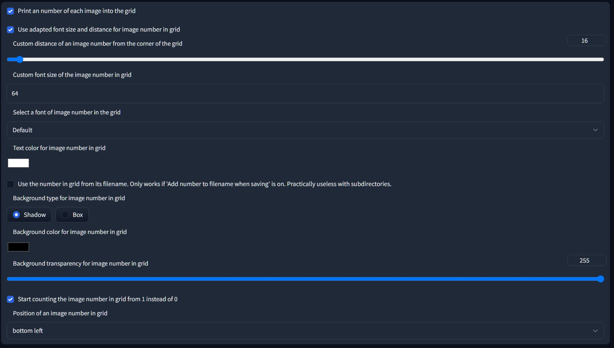
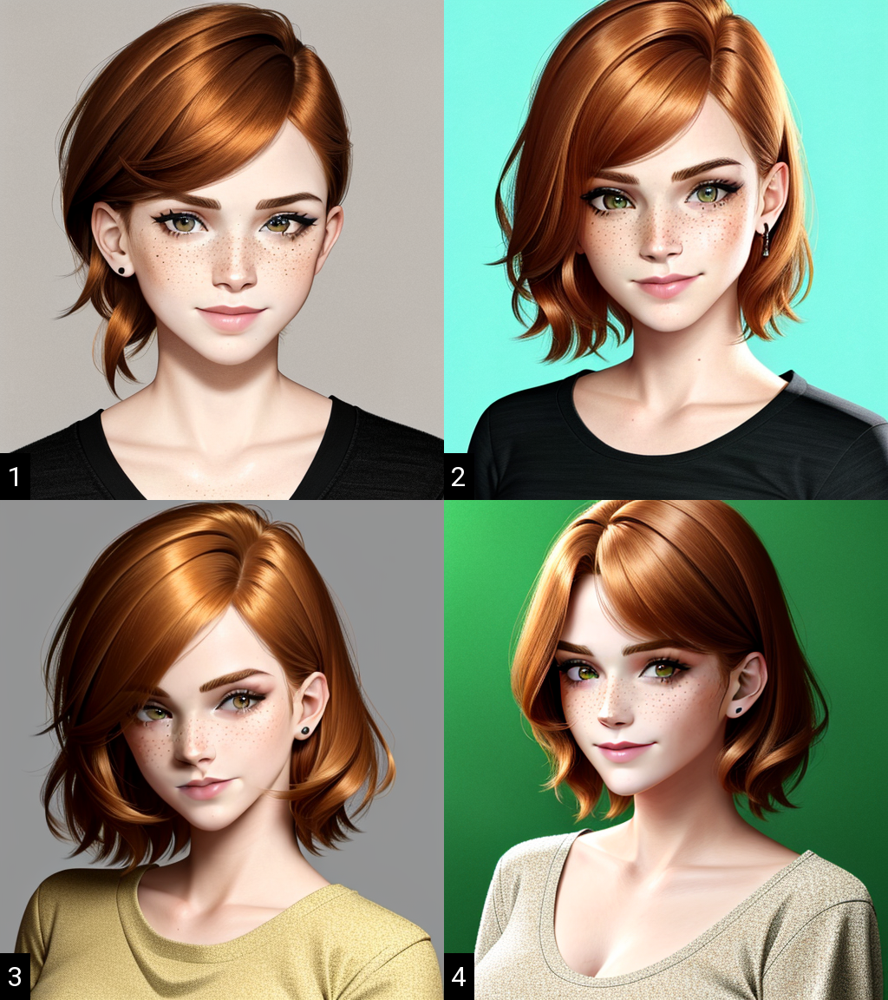
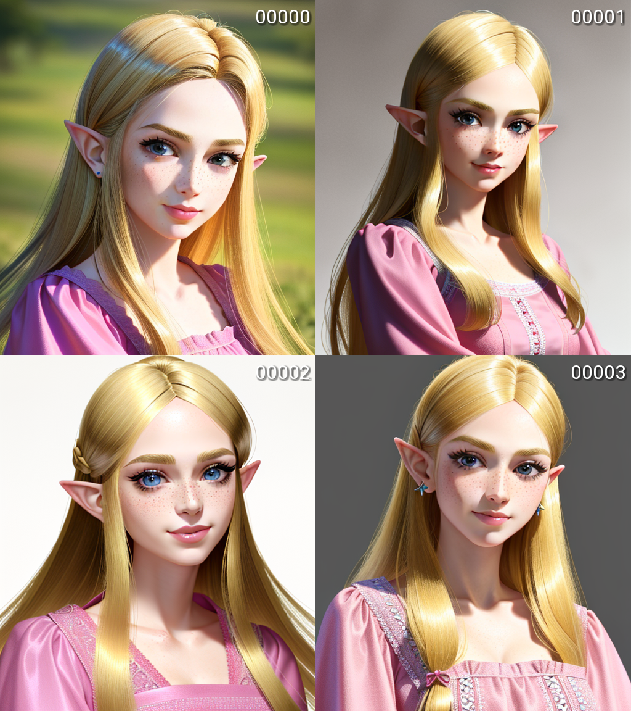

# Stable Diffusion Grid Image Number Extension

Are you tired of scrolling through a large batch of images on the [Stable Diffusion WebUI](https://github.com/AUTOMATIC1111/stable-diffusion-webui) without being able to easily identify them? Look no further! Introducing the Stable Diffusion Grid Image Number Extension.

This custom extension allows you to add the image's number to its picture in the grid, making it much easier to identify and organize your images. With this extension, you have the ability to customize the number's positioning, counting method (from the beginning of the grid or by filename), and color. It also offers the option for a shadow or box background mode.

Here's an example of the extension in action:

## Installation

The extension can be easily installed directly from within the **Extensions** tab within the Stable Diffusion WebUI. If you prefer to install it manually, you can run the following command from within the webui directory:

	git clone https://github.com/younyokel/sd_grid_image_number extensions/sd_grid_image_number